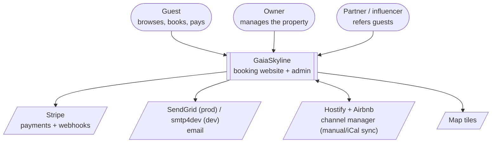
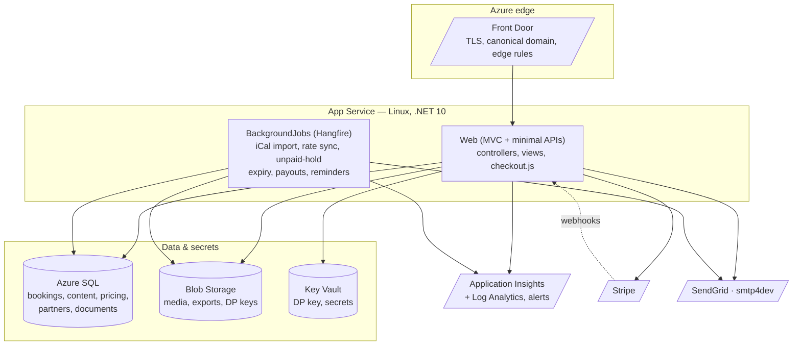
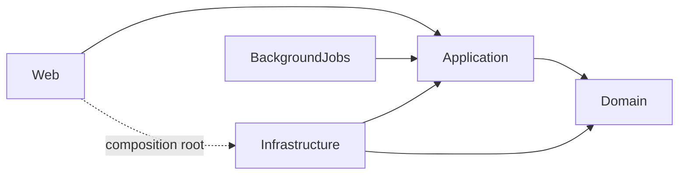

# GaiaSkyline — architecture

A direct-booking website for a single short-term rental in Vila Nova de Gaia: guests browse, book and pay
without platform fees; the owner runs everything from an admin area. ASP.NET Core (.NET 10), Clean
Architecture, SQL Server. The operational companion is the [runbook](runbook.md); decisions are in
[decisions/](decisions/).

## Context

## Containers

## Layers (Clean Architecture)

Dependencies point inward; EF Core and all I/O stay in Infrastructure.

| Project | Responsibility |
| --- | --- |
| **Domain** | Entities, value objects, strongly-typed ids, the booking/payment/commission state machines — no dependencies. |
| **Application** | Use-case interfaces + DTOs (ports): pricing, bookings, content, documents, payments, partners, storage, notifications. |
| **Infrastructure** | EF Core (`AppDbContext`, migrations), Stripe, email, media storage, the QuestPDF guest documents, seeding. |
| **BackgroundJobs** | Hangfire recurring jobs (calendar import, rate sync, unpaid-hold expiry, payouts, reminders). |
| **Web** | MVC controllers + Razor, localized routes (`/{lang}/…`), minimal APIs, the admin area, the composition root. |

## Key flows

- **Booking & payment.** `/book` quotes server-side (the client price is never trusted); checkout creates the
  booking + Stripe PaymentIntent; the `/webhooks/stripe` handler is the source of truth that confirms the
  booking, sends the localized email **with the branded PDF**, and notifies the owner. Card/wallet pay
  immediately; Multibanco confirms asynchronously on the voucher payment.
- **Guest documents.** Confirmation/receipt, payment receipt and cancellation/refund receipt are rendered
  with QuestPDF + embedded fonts (ADR 0025), cached in `BookingDocuments`, and regenerated on change. None is
  a tax invoice (*fatura*).
- **Calendar & pricing.** Owner-managed (manual) with Hostify until an iCal URL / rates API is wired; a daily
  per-date rate overrides season rules then the base rate.
- **Partner program.** Referral attribution → commission (basis = total − tourist tax − cleaning, net of
  refunds) → monthly payout statement.
- **Content.** Every public string is an owner-editable content block in five languages (EN/PT/ES/FR/DE).

## Cross-cutting

- **Localization** — `/{lang}/…` routes; per-culture dates and currency; `hreflang` + canonical for SEO.
- **Security** — owner login + TOTP, optional IP allowlist; guest access via account or booking-scoped
  magic link; partner JWT; Data Protection keys in Blob wrapped by Key Vault (ADR 0022); Stripe webhook
  signature verification; no secrets in source.
- **Observability** — Application Insights (requests, exceptions, Web Vitals), the Part D alert rules, and the
  admin dashboard health tiles.
- **Deployment** — Bicep (`infra/`), manual-dispatch GitHub Actions (`deploy.yml` with a staging-slot swap,
  `infra-deploy.yml`, `db-backup.yml`). See the runbook's Deployment phase.
